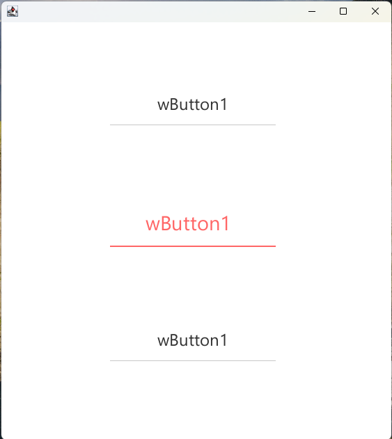
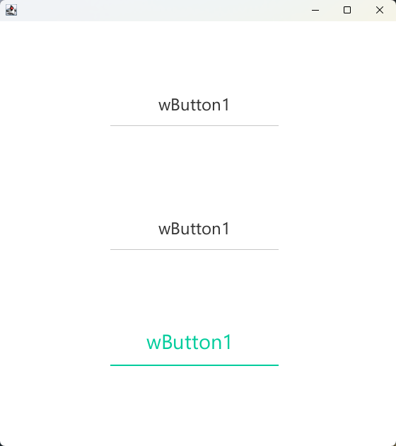
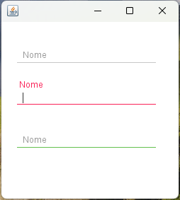

<div align="center">
    <h1>Componentes Swing Avançados</h1>
    <p>Biblioteca de componentes Java Swing com design moderno e recursos avançados</p>
</div>

## 🎨 Demonstração

### WButton - Botão Personalizado
<div align="center">
    <div>
        
        <p><em>1. Estado Normal</em></p>
    </div>
    <div style="display: inline-block; margin: 0 10px;">
        
        <p><em>2. WButton 2 - Estado Hover</em></p>
    </div>
    <div>
        
        <p><em>3. Estado Pressionado</em></p>
    </div>
</div>

### WTextField - Campo de Texto Avançado
<div align="center">
    
    
    <p><em>Exemplos de uso do WTextField</em></p>
</div>

Biblioteca de componentes Java Swing com design moderno e recursos avançados, desenvolvida para facilitar a criação de interfaces gráficas ricas e profissionais.

## 🚀 Componentes Disponíveis

### Campos de Entrada
- **WTextField**: Campo de texto com rótulo flutuante e validação integrada
- **WPasswordField**: Campo de senha seguro com opção de visualização
- **WComboBox**: Menu suspenso com suporte a busca e validação

### Controles de Seleção
- **WCheckBox**: Caixa de seleção com estados personalizáveis
- **WButton**: Botão com efeitos visuais e suporte a ícones

### Características Comuns
- **Rótulos Flutuantes**: Melhor experiência do usuário
- **Validação Integrada**: Suporte a campos obrigatórios e máscaras
- **Feedback Visual**: Animações suaves e indicadores de estado
- **Temas Personalizáveis**: Suporte nativo ao FlatLaf
- **Acessibilidade**: Totalmente compatível com leitores de tela

## 📦 Requisitos

- **Java**: 8 ou superior
- **Dependências Principais**:
  - `org.pushingpixels:trident` (1.6.0+) - Animações suaves
  - `com.formdev:flatlaf` (2.3+) - Temas modernos
- **Dependências Opcionais**:
  - `com.formdev:flatlaf-extras` - Componentes adicionais
  - `com.formdev:svgSalamander` - Suporte a ícones SVG

## 🛠️ Instalação

### Maven
```xml
<dependencies>
    <dependency>
        <groupId>br.com.warrick</groupId>
        <artifactId>swing-components</artifactId>
        <version>1.0.0</version>
    </dependency>
</dependencies>
```

### Gradle
```gradle
implementation 'br.com.warrick:swing-components:1.0.0'
```

## 📖 Documentação

### Guias de Referência
- [Estrutura dos Componentes](docs/Estrutura/ESTRUTURA_WSWING.md) - Padrões de desenvolvimento
- [Documentação em Markdown](docs/Estrutura/ESTRUTURA_WMD.md) - Modelo para documentação

### Componentes
- [WButton](docs/WComponentes/WButton.md) - Botão personalizado
- [WCheckBox](docs/WComponentes/WCheckBox.md) - Caixa de seleção
- [WComboBox](docs/WComponentes/WComboBox.md) - Menu suspenso
- [WPasswordField](docs/WComponentes/WPasswordField.md) - Campo de senha
- [WTextField](docs/WComponentes/WTextField.md) - Campo de texto

## 🚀 Começando

### Exemplo Rápido

```java
// Criando um formulário de login
JPanel painel = new JPanel(new GridBagLayout());
WTextField campoEmail = new WTextField("E-mail");
WPasswordField campoSenha = new WPasswordField("Senha");
WButton botaoEntrar = new WButton("Entrar");

// Adicionando ao painel
painel.add(campoEmail);
painel.add(campoSenha);
painel.add(botaoEntrar);
```

## 📄 Licença

Este projeto está licenciado sob a [MIT License](LICENSE).

## 🙏 Créditos

Baseado no trabalho original de [Ra Ven](https://github.com/DJ-Raven/raven-project).

### Melhorias e Manutenção
- **Animações**: Transições suaves e feedback visual
- **Temas**: Suporte a temas claros e escuros
- **Validação**: Sistema integrado de validação
- **Documentação**: Guias detalhados e exemplos

---

Desenvolvido e atualizado por Warrick - [GitHub](https://github.com/Icnus-Warrick)
