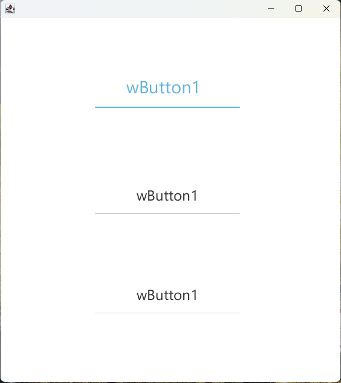
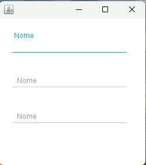

<div align="center">
    <h1>📦 Biblioteca de Componentes Swing</h1>
    <p>Componentes Java Swing modernos e altamente personalizáveis para desenvolvimento de interfaces profissionais</p>
    
    [](https://opensource.org/licenses/MIT)
    [](https://www.oracle.com/java/)
    [](https://github.com/Icnus-Warrick/projeto-w/stargazers)
</div>

## 🎨 Demonstração dos Componentes

### WButton - Botão Moderno
<div align="center">
    <div style="display: inline-block; margin: 0 10px;">
        
        <p><em>Estado Normal</em></p>
    </div>
    <div style="display: inline-block; margin: 0 10px;">
        
        <p><em>Estado Hover</em></p>
    </div>
    <div style="display: inline-block; margin: 0 10px;">
        
        <p><em>Estado Pressionado</em></p>
    </div>
</div>

### WTextField - Campo de Texto Avançado
<div align="center">
    
    
    <p><em>WTextField em diferentes estados</em></p>
</div>

### WLabel - Rótulo Interativo
<div align="center">
    <div style="background: #f5f5f5; padding: 20px; border-radius: 8px; display: inline-block;">
        <p>WLabel em ação (imagem será adicionada em breve)</p>
        <p><small>Execute a classe Teste_WComponentes para ver a demonstração</small></p>
    </div>
    <p><em>WLabel com linha de destaque interativa</em></p>
</div>

### WTextArea - Área de Texto Avançada
<div align="center">
    <div style="background: #f5f5f5; padding: 20px; border-radius: 8px; display: inline-block;">
        <p>WTextArea em ação (imagem será adicionada em breve)</p>
        <p><small>Execute a classe Teste_WComponentes para ver a demonstração</small></p>
    </div>
    <p><em>WTextArea com rótulo flutuante e validação integrada</em></p>
</div>

## 🚀 Recursos Principais

- **Design Moderno**: Componentes com aparência profissional e animações suaves
- **Fácil Integração**: Compatível com qualquer aplicação Java Swing existente
- **Temas Personalizáveis**: Suporte nativo ao FlatLaf para diferentes esquemas de cores
- **Documentação Completa**: Guias detalhados e exemplos para cada componente
- **Leve e Rápido**: Desempenho otimizado para aplicações desktop

## 📦 Componentes Disponíveis

### 📝 Campos de Entrada
- **WTextField**: Campo de texto com rótulo flutuante e validação integrada
- **WPasswordField**: Campo de senha seguro com opção de visualização
- **WComboBox**: Menu suspenso com suporte a busca e validação
- **WTextArea**: Área de texto com rótulo flutuante, validação e suporte a rolagem

### 🎛️ Controles de Interface
- **WButton**: Botão com efeitos visuais e suporte a ícones
- **WCheckBox**: Caixa de seleção com estados personalizáveis
- **WLabel**: Rótulo interativo com linha de destaque e efeito hover

### 🎨 Recursos Avançados
- **Validação em Tempo Real**: Feedback visual imediato para o usuário
- **Animações Suaves**: Transições fluidas para melhor experiência do usuário
- **Acessibilidade**: Totalmente compatível com leitores de tela
- **Suporte a Temas**: Mude facilmente entre temas claros e escuros
- **Documentação Detalhada**: Exemplos de uso e personalização para cada componente

## 🛠️ Como Usar

1. **Adicione a dependência** ao seu `pom.xml`:

```xml
<dependency>
    <groupId>br.com.warrick</groupId>
    <artifactId>projeto-w</artifactId>
    <version>1.0.0</version>
</dependency>
```

2. **Importe os componentes** no seu código:

```java
import br.com.warrick.swing.WButton;
import br.com.warrick.swing.WTextField;
import br.com.warrick.swing.WLabel;
```

3. **Crie e personalize** os componentes:

```java
// Criando um botão personalizado
WButton button = new WButton("Clique Aqui");
button.setBackground(new Color(0, 120, 215));
button.setForeground(Color.WHITE);

// Criando um campo de texto com rótulo flutuante
WTextField textField = new WTextField();
textField.setLabelText("Nome Completo");

// Criando um rótulo interativo
WLabel label = new WLabel("Informações Importantes");
label.setLineColor(new Color(0, 120, 215));
```

## 📚 Documentação Detalhada

Cada componente possui sua própria documentação detalhada na pasta `docs/WComponentes/`:

- [WButton](docs/WComponentes/WButton.md) - Botão personalizável
- [WCheckBox](docs/WComponentes/WCheckBox.md) - Caixa de seleção
- [WComboBox](docs/WComponentes/WComboBox.md) - Menu suspenso com busca
- [WLabel](docs/WComponentes/WLabel.md) - Rótulo interativo
- [WPasswordField](docs/WComponentes/WPasswordField.md) - Campo de senha seguro
- [WTextArea](docs/WComponentes/WTextArea.md) - Área de texto com rótulo flutuante
- [WTextField](docs/WComponentes/WTextField.md) - Campo de texto avançado

## 🤝 Contribuindo

Contribuições são bem-vindas! Sinta-se à vontade para abrir issues e enviar pull requests.

1. Faça um fork do projeto
2. Crie uma branch para sua feature (`git checkout -b feature/AmazingFeature`)
3. Faça commit das suas alterações (`git commit -m 'Add some AmazingFeature'`)
4. Faça push para a branch (`git push origin feature/AmazingFeature`)
5. Abra um Pull Request

## 📄 Licença

Este projeto está licenciado sob a licença MIT - veja o arquivo [LICENSE](LICENSE) para detalhes.

## ✨ Agradecimentos

- [FlatLaf](https://www.formdev.com/flatlaf/) - Por fornecer um Look and Feel moderno para Java Swing
- [Trident](https://github.com/kirill-grouchnikov/radiance) - Biblioteca de animações para Java
- [Ra Ven](https://github.com/DJ-Raven/raven-project) - Projeto original na qual me inspirou 
- A todos os contribuidores que ajudaram a melhorar este projeto!

## 📦 Requisitos

- **Java**: 8 ou superior
- **Dependências Principais**:
  - `org.pushingpixels:trident` (1.6.0+) - Animações suaves
  - `com.formdev:flatlaf` (2.3+) - Temas modernos
- **Dependências Opcionais**:
  - `com.formdev:flatlaf-extras` - Componentes adicionais
  - `com.formdev:svgSalamander` - Suporte a ícones SVG

## 🛠️ Instalação

### Maven
```xml
<dependencies>
    <dependency>
        <groupId>br.com.warrick</groupId>
        <artifactId>swing-components</artifactId>
        <version>1.0.0</version>
    </dependency>
</dependencies>
```

### Gradle
```gradle
implementation 'br.com.warrick:swing-components:1.0.0'
```

## 📖 Documentação

### Guias de Referência
- [Estrutura dos Componentes](docs/Estrutura/ESTRUTURA_WSWING.md) - Padrões de desenvolvimento
- [Documentação em Markdown](docs/Estrutura/ESTRUTURA_WMD.md) - Modelo para documentação

### Componentes
- [WButton](docs/WComponentes/WButton.md) - Botão personalizado
- [WCheckBox](docs/WComponentes/WCheckBox.md) - Caixa de seleção
- [WComboBox](docs/WComponentes/WComboBox.md) - Menu suspenso
- [WLabel](docs/WComponentes/WLabel.md) - Rótulo interativo com linha de destaque
- [WPasswordField](docs/WComponentes/WPasswordField.md) - Campo de senha
- [WTextArea](docs/WComponentes/WTextArea.md) - Área de texto com rolagem e rótulo flutuante
- [WTextField](docs/WComponentes/WTextField.md) - Campo de texto

## 🚀 Começando

### Exemplo Rápido

```java
// Criando um formulário de login
JPanel painel = new JPanel(new GridBagLayout());
WTextField campoEmail = new WTextField("E-mail");
WPasswordField campoSenha = new WPasswordField("Senha");
WButton botaoEntrar = new WButton("Entrar");

// Adicionando ao painel
painel.add(campoEmail);
painel.add(campoSenha);
painel.add(botaoEntrar);
```

## 📄 Licença

Este projeto está licenciado sob a [MIT License](LICENSE).

## 🙏 Créditos

Baseado no trabalho original de [Ra Ven](https://github.com/DJ-Raven/raven-project).

### Melhorias e Manutenção
- **Animações**: Transições suaves e feedback visual
- **Temas**: Suporte a temas claros e escuros
- **Validação**: Sistema integrado de validação
- **Documentação**: Guias detalhados e exemplos

---

Desenvolvido e atualizado por Warrick - [GitHub](https://github.com/Icnus-Warrick)
